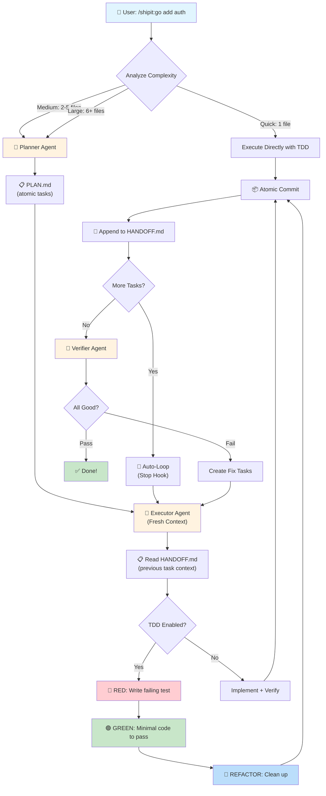
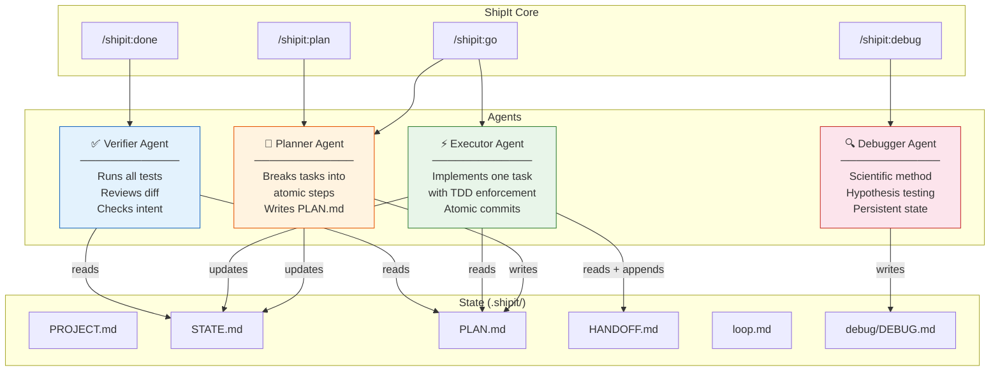
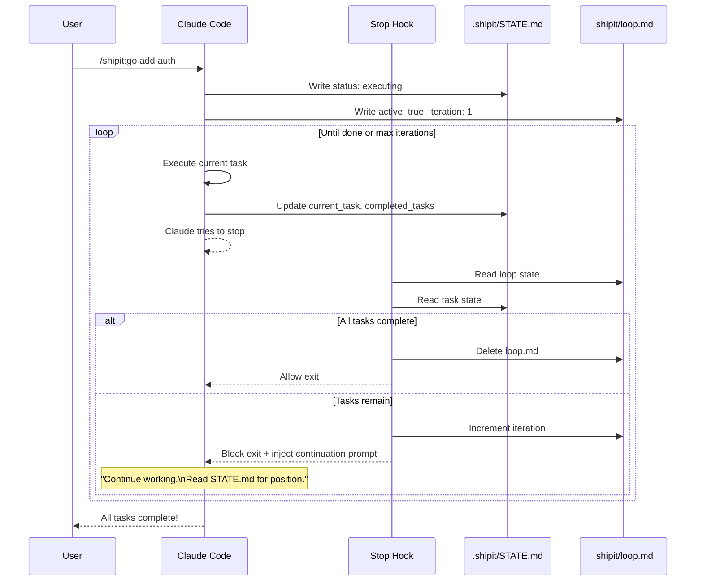
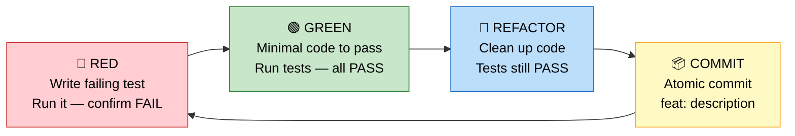
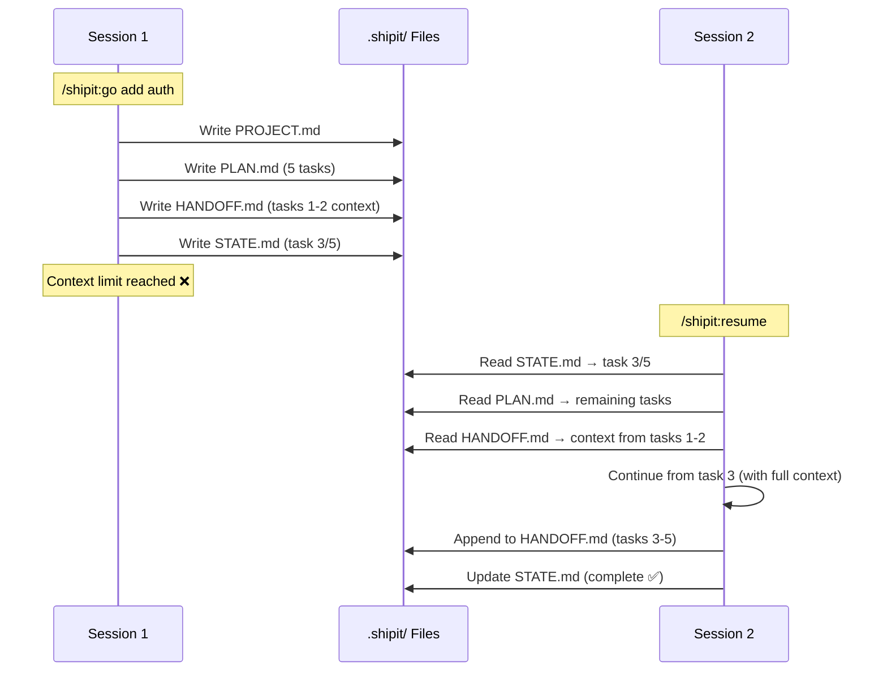

<p align="center">
  <h1 align="center">🚀 ShipIt</h1>
  <p align="center">
    <strong>One command to ship features. Plan → Execute → Loop → Done.</strong>
  </p>
  <p align="center">
    <a href="#installation">Install</a> · <a href="#quick-start">Quick Start</a> · <a href="#commands">Commands</a> · <a href="#how-it-works">How It Works</a> · <a href="#architecture">Architecture</a>
  </p>
  <p align="center">
    
    
    
  </p>
</p>

---

ShipIt is a **Claude Code plugin** that turns a single sentence into shipped code. It combines smart task decomposition, TDD enforcement, multi-agent execution, and auto-looping into one seamless workflow.

> **No more babysitting.** Tell Claude what to build. ShipIt plans it, tests it, loops until it's done, and persists state across sessions.

### Why ShipIt?

- **🧠 Smart Routing** — Auto-detects task complexity (quick/medium/large) and plans accordingly
- **🧪 TDD by Default** — Every code change goes through RED → GREEN → REFACTOR
- **🔁 Auto-Loop** — Keeps working autonomously until all tasks complete or a blocker is hit
- **🤖 Multi-Agent** — Specialized agents for planning, execution, debugging, and verification
- **📋 Task Handoff** — Cumulative HANDOFF.md gives each fresh executor full context of previous work
- **💾 Persistent State** — Resume across sessions with `.shipit/` state files
- **📦 Atomic Commits** — One commit per completed task, clean git history

---

## Requirements

- [Claude Code](https://docs.anthropic.com/en/docs/claude-code) CLI (latest version)
- Git (for atomic commits and PR workflows)

---

## Installation

### Quick Install (2 commands)

Run these inside Claude Code:

```
/plugin marketplace add praful011/shipit
```

```
/plugin install shipit@shipit-marketplace
```

Restart Claude Code. Done! You now have `/shipit:go` and all other commands.

### Alternative: Direct from Git (Development)

Load ShipIt without installing — great for development or trying it out:

```bash
claude --plugin-dir /path/to/shipit
```

Or clone and load:

```bash
git clone https://github.com/praful011/shipit.git
claude --plugin-dir ./shipit
```

### Alternative: Add to Your Own Marketplace

If you maintain a custom marketplace, add ShipIt as a plugin source:

```json
{
  "name": "shipit",
  "source": {
    "source": "url",
    "url": "https://github.com/praful011/shipit.git"
  },
  "description": "One command to ship features.",
  "version": "1.0.0"
}
```

Then install:

```
/plugin install shipit@your-marketplace
```

---

## Quick Start

### Ship a feature in one command

```
/shipit:go add user authentication with JWT tokens
```

That's it. ShipIt will:
1. **Analyze** your codebase to understand the context
2. **Plan** the work into atomic tasks
3. **Execute** each task with TDD in a fresh context (test first, then implement)
4. **Handoff** context between tasks via HANDOFF.md
5. **Loop** autonomously until everything's done
6. **Verify** the result matches the original intent

### More examples

```
/shipit:go fix the login bug where sessions expire after 5 minutes
```

```
/shipit:go refactor the payment module to use Stripe SDK v3
```

```
/shipit:go add dark mode support to the settings page
```

### Plan first, then execute

```
/shipit:plan redesign the database schema for multi-tenancy
```

Review the plan, then approve to start execution.

### Debug systematically

```
/shipit:debug users get 403 after password reset
```

Uses the scientific method: reproduce → hypothesize → test → fix.

---

## Commands

### `/shipit:go <task>`

**The main command.** Auto-detects task complexity, plans, executes with TDD, and loops until done.

```
/shipit:go add user authentication with JWT tokens
/shipit:go fix the cart total not updating on item removal
/shipit:go refactor the API layer to use async/await
```

| Complexity | Files | What happens |
|------------|-------|-------------|
| **Quick** | 1 file | Executes directly with TDD |
| **Medium** | 2–5 files | Auto-plans 2–4 tasks, then executes |
| **Large** | 6+ files | Plans 4–8 tasks, considers parallel agents |

---

### `/shipit:plan <description>`

Creates a detailed plan and presents it for your approval before executing.

```
/shipit:plan redesign the database schema for multi-tenancy
/shipit:plan migrate from REST to GraphQL
```

Good for large or risky changes where you want to review the approach first.

---

### `/shipit:init [project-name]`

Sets up a new project. Scans your codebase, asks a few questions, and creates `.shipit/` with `PROJECT.md` and `config.json`.

```
/shipit:init my-saas-app
```

Optional — `/shipit:go` will auto-initialize if needed.

---

### `/shipit:resume`

Picks up where you left off. Reads `.shipit/STATE.md` and continues from the last task.

```
/shipit:resume
```

Works across sessions — state persists in `.shipit/`.

---

### `/shipit:status`

Shows a progress dashboard: tasks completed, current task, loop state, recent commits.

```
/shipit:status
```

Example output:

```
## ShipIt Status

Project:  my-saas-app
Status:   executing
Progress: 3/5 tasks (60%)

Current Task: Task 4 — Add rate limiting middleware
Loop:         active (iteration 12/50)
Recent:       feat: add auth middleware | feat: add user model | test: auth tests
```

---

### `/shipit:debug <issue>`

Systematic debugging using the scientific method. State persists in `.shipit/debug/DEBUG.md`.

```
/shipit:debug login returns 403 after password reset
/shipit:debug memory leak in WebSocket handler
```

Process: **Reproduce → Hypothesize → Test → Fix**

Never guesses. Always verifies. One change at a time.

---

### `/shipit:done`

Verifies completed work and offers finishing options.

```
/shipit:done
```

Runs the verifier agent, then asks:

1. **Commit** — Stage and commit with a summary message
2. **Create PR** — Push to branch, open a pull request
3. **Keep working** — Not done yet
4. **Just report** — Show what changed, don't commit

---

### `/shipit:discuss <topic>`

Discussion mode — chat about your project, architecture, or ideas **without making any code changes.** ShipIt will read your codebase to give informed answers but won't modify anything.

```
/shipit:discuss should we use Redis or Memcached for caching?
/shipit:discuss walk me through the auth flow
/shipit:discuss what's the best way to handle file uploads?
```

Great for:
- Exploring approaches before committing to implementation
- Understanding existing code
- Comparing libraries, patterns, or architectures
- Planning ahead without writing a formal plan

---

### `/shipit:update`

Update ShipIt to the latest version from the remote repository.

```
/shipit:update
```

Shows what changed, asks for confirmation, then pulls the latest. Restart Claude Code after updating to load the new version.

---

### `/shipit:help`

Shows the full usage guide with all commands and examples.

```
/shipit:help
```

---

## Configuration

ShipIt stores configuration in `.shipit/config.json`:

```json
{
  "tdd": true,
  "auto_loop": true,
  "max_iterations": 50,
  "auto_commit": true,
  "parallel_execution": true,
  "max_parallel_agents": 3
}
```

| Option | Default | Description |
|--------|---------|-------------|
| `tdd` | `true` | Enforce TDD (RED → GREEN → REFACTOR) for code changes |
| `auto_loop` | `true` | Keep working autonomously until done or blocked |
| `max_iterations` | `50` | Maximum loop iterations before stopping |
| `auto_commit` | `true` | Commit after each completed task |
| `parallel_execution` | `true` | Allow parallel agent execution for independent tasks |
| `max_parallel_agents` | `3` | Maximum concurrent agents |

---

## State Files

ShipIt persists all state in the `.shipit/` directory:

```
.shipit/
├── PROJECT.md      # What the project is about
├── STATE.md        # Current progress and position
├── PLAN.md         # Active plan with tasks
├── HANDOFF.md      # Cumulative context from completed tasks
├── config.json     # Preferences
├── loop.md         # Auto-loop state (managed automatically)
└── debug/
    └── DEBUG.md    # Debugging session state
```

| File | Purpose | Created by |
|------|---------|------------|
| `PROJECT.md` | Project description, tech stack, constraints | `/shipit:init` |
| `STATE.md` | Status, current task number, timestamps | `/shipit:go` |
| `PLAN.md` | Task list with descriptions and acceptance criteria | Planner agent |
| `HANDOFF.md` | Cumulative log of completed tasks with context | Executor agent |
| `config.json` | User preferences | `/shipit:init` |
| `loop.md` | Loop iteration counter, active flag | Stop hook |
| `debug/DEBUG.md` | Hypotheses, test results, root cause | Debugger agent |

> **Tip:** Add `.shipit/` to your `.gitignore` — it's session state, not source code.

---

## How It Works

### The Main Flow

When you run `/shipit:go <task>`, here's what happens:



---

## Architecture

### Multi-Agent System

ShipIt uses 4 specialized agents, each spawned on demand:



### Task Handoff (HANDOFF.md)

Each executor agent runs in a **fresh context window** (via Claude Code's Task tool). This means each task starts clean — no context overflow, even on large plans. But fresh context also means the executor has no knowledge of what previous tasks did.

**HANDOFF.md** solves this. It's a cumulative log that each executor reads at start and appends to at finish:

```markdown
# ShipIt Handoff Log

## Task 1: Set up Stripe SDK ✅
- **Files changed:** src/config/stripe.ts, package.json
- **What was done:** Installed stripe@14, created config with env var
- **Key decisions:** Used STRIPE_SECRET_KEY env var, added to .env.example
- **Context for next tasks:** Import stripe config from src/config/stripe.ts

## Task 2: Create payment endpoint ✅
- **Files changed:** src/api/payments.ts, src/api/payments.test.ts
- **What was done:** POST /api/payments creates payment intent
- **Key decisions:** Returns client_secret directly, validates amount > 0
- **Context for next tasks:** Endpoint expects {amount, currency} body
```

**Key behaviors:**
- **Reset per plan** — HANDOFF.md is created fresh with each `/shipit:go` command, so previous plan context doesn't leak
- **Cumulative within a plan** — Each completed task appends its entry, so Task 5 knows what Tasks 1-4 did
- **Concise entries** — Each task summary is ~4-5 lines, keeping the file small even for large plans

This gives ShipIt the best of both worlds: fresh executor context (no overflow) + full knowledge of previous work (no blind spots).

### Context Window Display

During loop execution, the statusline shows real-time context window usage next to the loop counter:

```
ShipIt │ ⎇ main │ Add auth │ 🚀 2/5 │ 🔁 3/50 ███░░░░░░░ 39% │ ⏱ 12m │ Opus 4.6 │ my-app
```

The context bar uses color coding:
- **Green** (0-62%) — Plenty of room
- **Yellow** (63-80%) — Getting full
- **Orange** (81-94%) — Nearly full
- **Red + skull** (95%+) — Critical, loop will likely end soon

### Auto-Loop Mechanism

The auto-loop uses Claude Code's **Stop hook** to keep execution going:



### TDD Cycle

Every code task follows the RED → GREEN → REFACTOR cycle:



> **Hard gate:** If TDD is enabled, the executor CANNOT mark a task complete without test output showing PASS. Wrote code before the test? Delete it. Start over.

### Session Persistence

State files in `.shipit/` allow work to survive across sessions:



---

## Comparison

How ShipIt compares to other Claude Code plugins:

| Feature | ShipIt | [Superpowers](https://github.com/obra/superpowers) | [GSD](https://github.com/get-shit-done) | [Ralph Loop](https://github.com/anthropics/claude-plugins-official) |
|---------|--------|-------------|-----|------------|
| One-command execution | `/shipit:go` | Manual | Multi-step | Manual |
| Smart task decomposition | Auto-detect complexity | Manual planning | Phase-based roadmap | N/A |
| TDD enforcement | Built-in hard gate | Skill (optional) | No | No |
| Auto-loop | Stop hook based | No | No | Stop hook based |
| Fresh executor context | Yes (Task subagents) | No | Yes | No (same session) |
| Cross-task context | HANDOFF.md | No | No | No (relies on files) |
| Multi-agent | 4 specialized agents | Subagent dispatch | 10+ agents | No |
| Session persistence | `.shipit/` flat files | No | `.planning/` directory | No |
| Context window display | Statusline with % bar | No | No | No |
| Debugging workflow | Scientific method | Systematic skill | Debug agent | No |
| Verification | Verifier agent | Code review skill | Verifier agent | No |
| Setup complexity | Zero config | Zero config | `PROJECT.md` + roadmap | Zero config |

ShipIt takes the best ideas from each and combines them into a single, streamlined workflow.

---

## Plugin Structure

```
shipit/
├── .claude-plugin/
│   └── plugin.json        # Plugin metadata
├── agents/
│   ├── shipit-planner.md  # Task decomposition agent
│   ├── shipit-executor.md # TDD execution agent
│   ├── shipit-debugger.md # Scientific debugging agent
│   └── shipit-verifier.md # Work verification agent
├── commands/
│   ├── go.md              # /shipit:go — main command
│   ├── plan.md            # /shipit:plan — plan + review
│   ├── init.md            # /shipit:init — project setup
│   ├── resume.md          # /shipit:resume — continue work
│   ├── status.md          # /shipit:status — progress dashboard
│   ├── debug.md           # /shipit:debug — systematic debugging
│   ├── done.md            # /shipit:done — verify + finish
│   ├── discuss.md         # /shipit:discuss — discussion mode
│   ├── update.md          # /shipit:update — update plugin
│   └── help.md            # /shipit:help — usage guide
├── hooks/
│   ├── hooks.json         # Hook configuration
│   ├── session-start.sh   # Injects ShipIt awareness
│   ├── stop-hook.sh       # Auto-loop mechanism
│   └── statusline.js      # Custom status line
├── skills/
│   ├── shipit-core/       # Core awareness skill
│   └── tdd/               # TDD reference skill
├── scripts/
│   └── setup-loop.sh      # Loop initialization
├── bin/
│   └── shipit-tools.cjs   # CLI utilities
├── settings.json           # Plugin settings (statusline)
├── LICENSE
└── README.md
```

---

## Author

**Praful** — [@praful011](https://github.com/praful011)

---

## License

[MIT](LICENSE) — Use it, fork it, ship with it.
