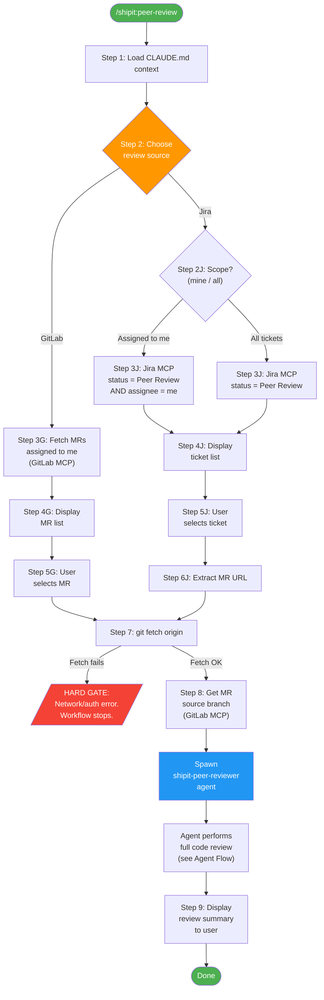
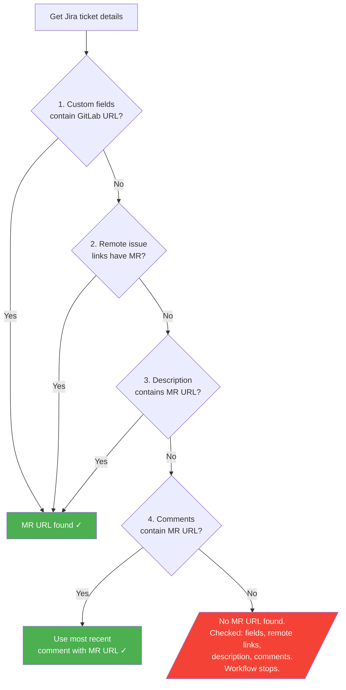
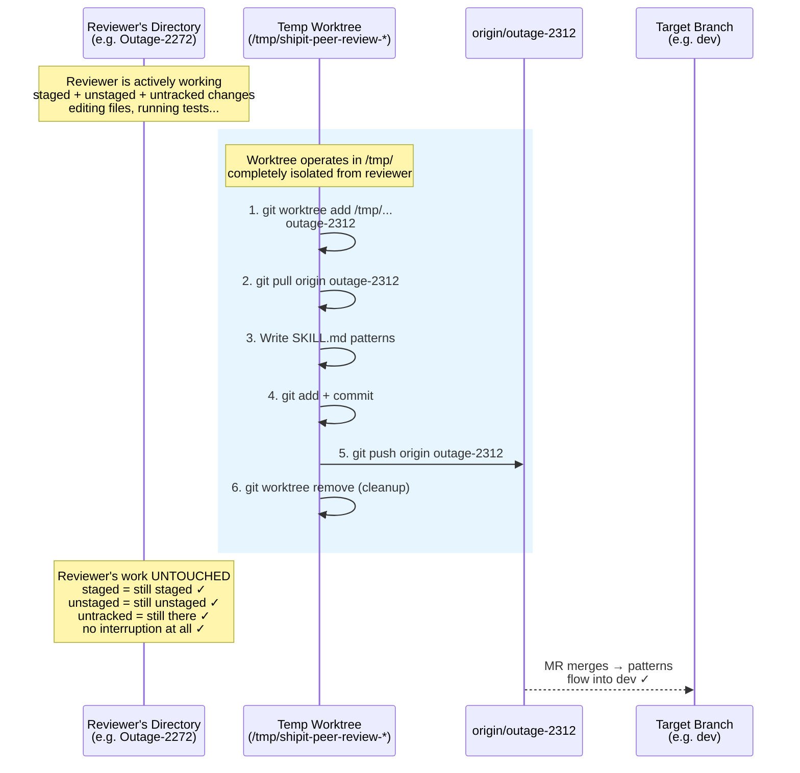
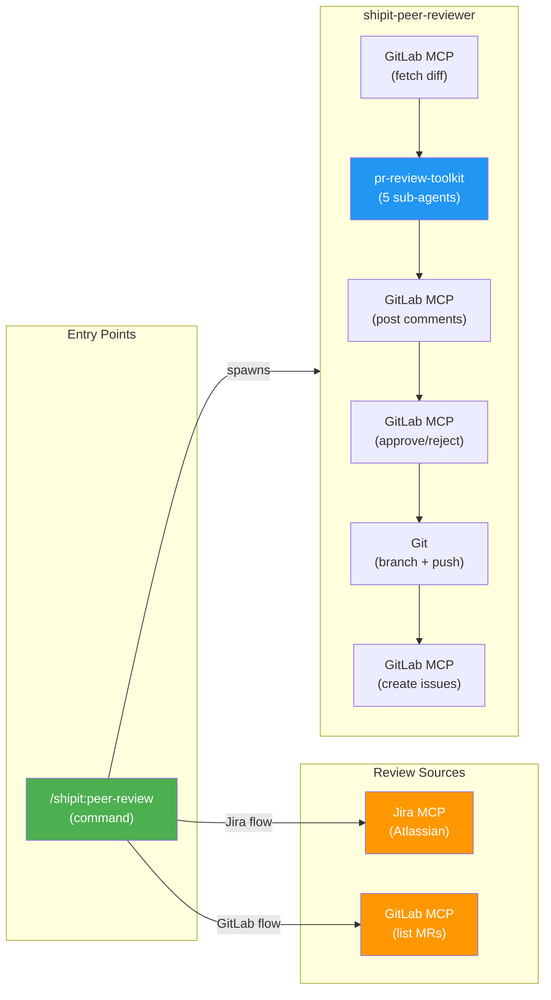

# Peer Review Workflow — Architecture Flowchart

## High-Level Flow

## MR URL Extraction (Jira Flow — Step 6J)

## Agent Internal Flow

```mermaid
flowchart TD
    INPUT["Input: MR URL, Ticket Key,\nSource Branch, Target Branch,\nGitLab Project Path"] --> PARSE["Step 1: Parse MR URL\n→ project path + IID"]
    PARSE --> FETCH_MR["Step 2: Fetch MR\nvia GitLab MCP\n(metadata + diff)"]

    FETCH_MR -->|MR not found| ERR_MR[/"Error: MR not found\nor no permissions"/]
    FETCH_MR -->|OK| REVIEW

    REVIEW["Step 3: HARD GATE\nCall /pr-review-toolkit:review-pr"] --> TOOLKIT

    subgraph TOOLKIT ["pr-review-toolkit (5 sub-agents)"]
        direction LR
        CR["Code\nReviewer"]
        SFH["Silent Failure\nHunter"]
        PTA["Test\nAnalyzer"]
        TDA["Type Design\nAnalyzer"]
        CA["Comment\nAnalyzer"]
    end

    TOOLKIT --> CATEGORIZE{"Step 4: Categorize\nverdict"}

    CATEGORIZE -->|"No CRITICAL\nNo IMPORTANT"| APPROVE["APPROVE"]
    CATEGORIZE -->|"Any CRITICAL or\n2+ IMPORTANT"| REQUEST["REQUEST\nCHANGES"]

    APPROVE --> POST_COMMENTS["Step 5: Post review\ncomments on GitLab MR"]
    REQUEST --> POST_COMMENTS

    POST_COMMENTS --> ACTION{"Step 6: Take action"}
    ACTION -->|Approved| DO_APPROVE["Approve MR\nvia GitLab MCP"]
    ACTION -->|Changes requested| NO_APPROVE["Do NOT approve\n(comments serve\nas documentation)"]

    DO_APPROVE --> HAS_FINDINGS{"CRITICAL or\nIMPORTANT\nfindings?"}
    NO_APPROVE --> HAS_FINDINGS

    HAS_FINDINGS -->|No| RETURN["Step 7: Return\nsummary"]
    HAS_FINDINGS -->|Yes| PATTERNS

    subgraph PATTERNS ["Step 6.5: Pattern Extraction (best-effort)"]
        direction TB
        P1["Filter CRITICAL +\nIMPORTANT findings"]
        P2["Generalize patterns\n(remove MR-specific details)"]
        P3["Read/create\nSKILL.md in project"]
        P4["Deduplicate\n(30 entry cap)"]
        P5["Create temp worktree\non MR source branch\ncommit + push + cleanup"]
        P1 --> P2 --> P3 --> P4 --> P5
    end

    PATTERNS --> HAS_CRITICAL{"Any CRITICAL\nfindings?"}

    HAS_CRITICAL -->|No| RETURN
    HAS_CRITICAL -->|Yes| ISSUES

    subgraph ISSUES ["Step 6.6: GitLab Issues (best-effort)"]
        direction TB
        I1["For each CRITICAL finding:\ncreate GitLab issue"]
        I2["Labels: peer-review,\ncritical, bug"]
        I1 --> I2
    end

    ISSUES --> RETURN
    RETURN --> END([Return to command])

    style INPUT fill:#2196F3,color:#fff
    style REVIEW fill:#ff5722,color:#fff
    style ERR_MR fill:#f44336,color:#fff
    style APPROVE fill:#4CAF50,color:#fff
    style REQUEST fill:#f44336,color:#fff
    style END fill:#4CAF50,color:#fff
```

## Branch Strategy (Pattern Commits)

## System Dependencies

